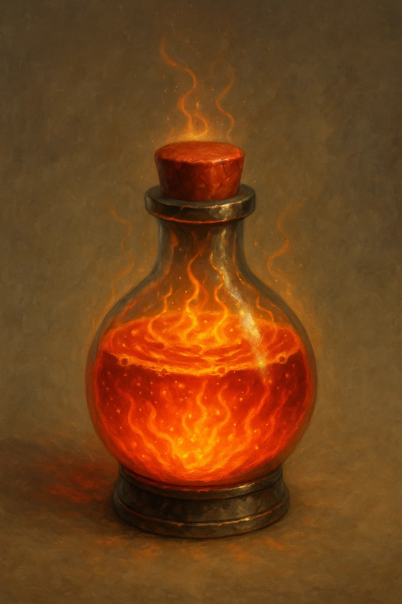
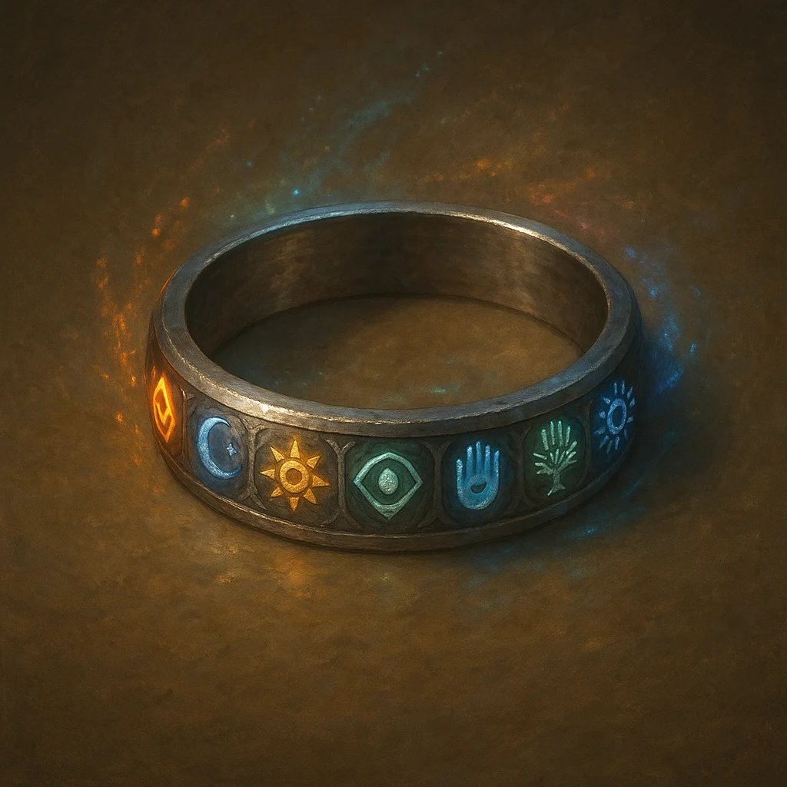
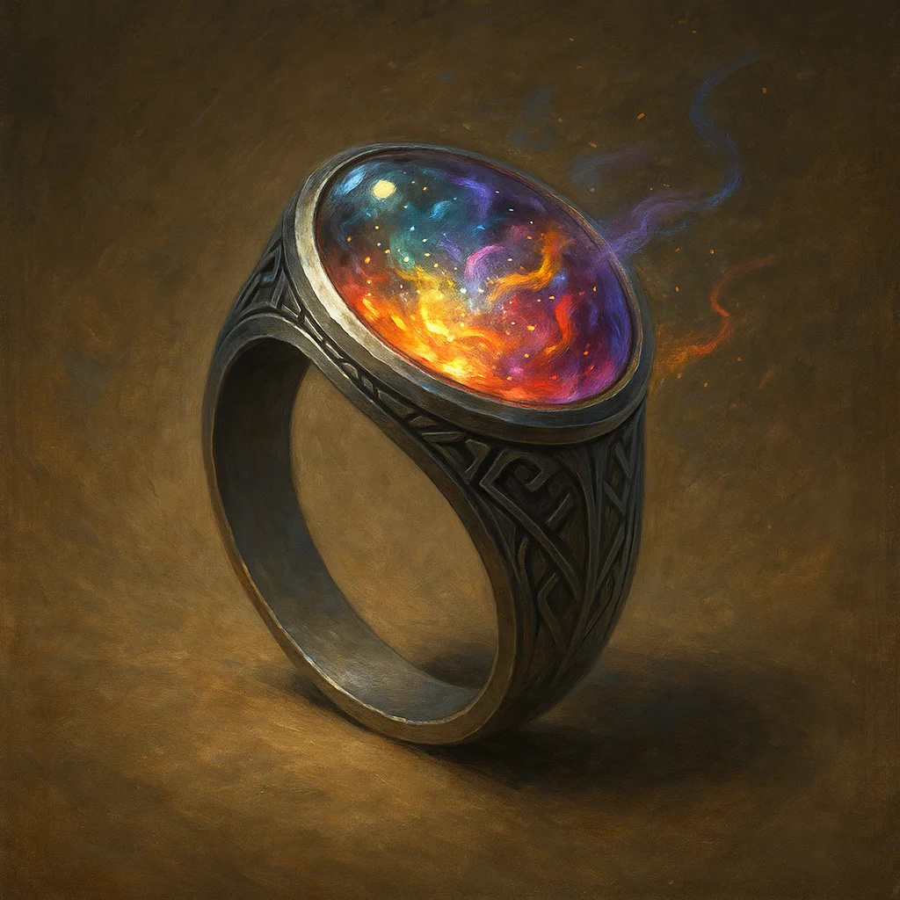
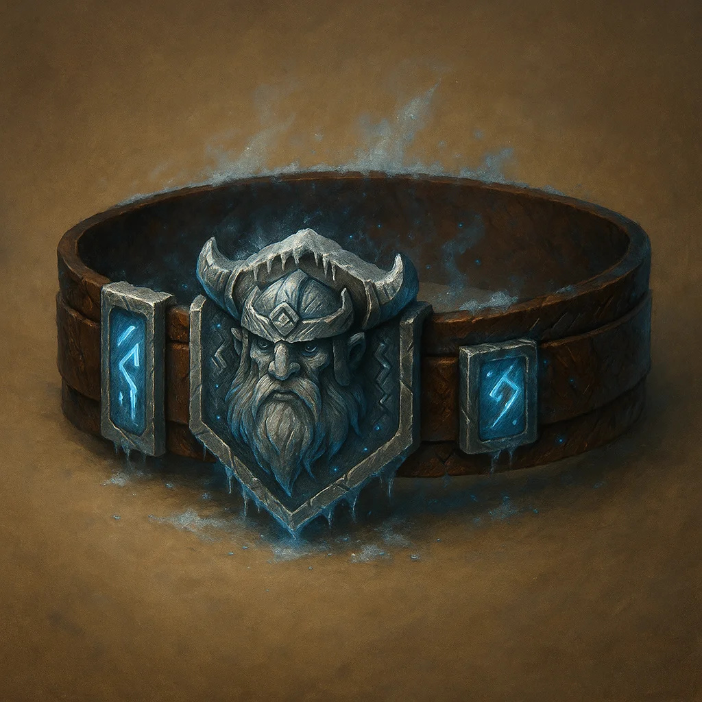
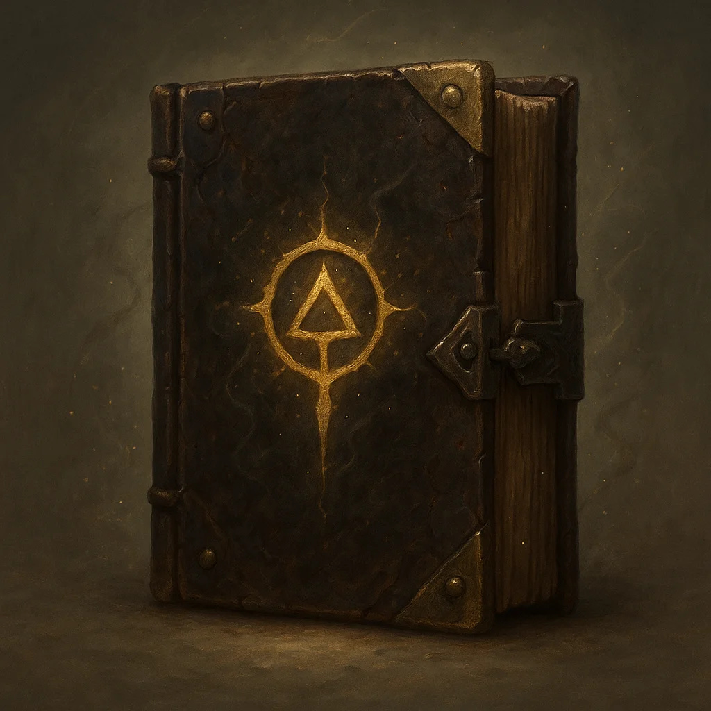
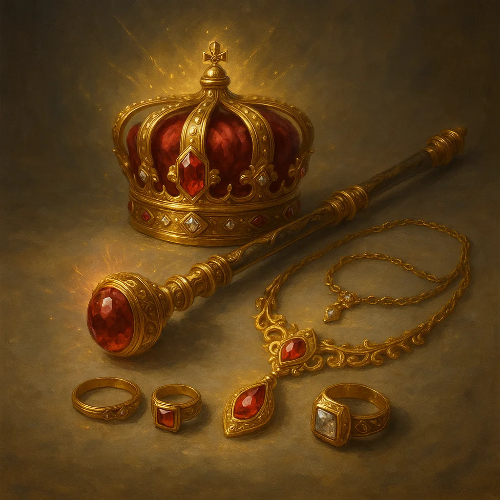

# Treasure & Magic Items
## Comprehensive Catalog with Images

---

## Using Treasure in Tirvandor

Magic items are rare and significant. Each item has history and often ties to specific NPCs or factions.

**Rarity Levels:**
- **Common:** 50-100 gp
- **Uncommon:** 101-500 gp
- **Rare:** 501-5,000 gp
- **Very Rare:** 5,001-50,000 gp
- **Legendary:** 50,001+ gp
- **Artifact:** Priceless, plot-significant

---

## Complete Magic Item Catalog

All 43 Tirvandor magic items with artwork, complete descriptions, and mechanics.

---

### 1: BORDER CAPTAIN'S BADGE

**Type:** Wondrous Item  
**Rarity:** Uncommon  
**Attunement:** No Attunement  

**Properties:**

- +2 to Persuasion checks
- Free passage at borders
- Command respect
- Identifies wearer as

**Campaign:** Universal  
**Signature NPC:** Border patrol officers  

---

### 2: CLOAK OF ELVENKIND - SILVERPINE VARIANT

**Type:** Wondrous Item  
**Rarity:** Uncommon  
**Attunement:** No Attunement  

**Properties:**

- Advantage on Stealth
- Pull hood to obscure face
- Forest green with leaf
- Silverpine craftsmanship
- Blends into nature

**Campaign:** Shattered Oaths  

---

### 3: NECKLACE OF ADAPTATION

**Type:** Wondrous Item  
**Rarity:** Uncommon  
**Attunement:** No Attunement  

**Properties:**

- Breathe in any environment
- Underwater, poison gas,
- Does NOT grant swim speed
- Ocean-themed design
- Perfect for Goldshore

**Campaign:** Shattered Oaths  
**Signature NPC:** House Goldshore  

---

### 4: POTION OF FIRE RESISTANCE

**Type:** Wondrous Item  
**Rarity:** Uncommon  
**Attunement:** No Attunement  

**Properties:**

- Drink as action
- Grants fire resistance
- Orange flames swirl inside
- Heat smoke rises from cork
- Single use

**Campaign:** Universal  

---

### 5: POTION OF GREATER HEALING

**Type:** Wondrous Item  
**Rarity:** Uncommon  
**Attunement:** No Attunement  

**Properties:**

- Drink as action
- Heals 4d4+4 hit points
- Red liquid with sparkles
- Most common healing potion
- Single use

**Campaign:** Universal  

---

### 6: RING OF MIND SHIELDING

**Type:** Wondrous Item  
**Rarity:** Uncommon  
**Attunement:** No Attunement  

**Properties:**

- Immune to magic reading
- Can't be detected by
- Soul trapped on death
- Communicate with soul

**Campaign:** Blood & Coin  

---

### 7: WAND OF MAGIC MISSILES

**Type:** Wondrous Item  
**Rarity:** Uncommon  
**Attunement:** No Attunement  

**Properties:**

- 7 charges
- Cast Magic Missile:
- Regain 1d6+1 at dawn

**Campaign:** Universal  

---

### 8: ADMIRAL'S TELESCOPE

**Type:** Wondrous Item  
**Rarity:** Rare  
**Attunement:** No Attunement  

**Properties:**

- See 10× normal distance
- Advantage on Perception
- Identify ships 5 miles out
- Brass nautical design
- House Goldshore heirloom

**Campaign:** Shattered Oaths  
**Signature NPC:** House Goldshore  

---

### 9: AMULET OF HEALTH

**Type:** Wondrous Item  
**Rarity:** Uncommon  
**Attunement:** No Attunement  

**Properties:**

- Constitution becomes 19
- Does not stack with items
- Perfect for frail wizards
- Classic D&D item
- Red gemstone design

**Campaign:** Universal  

---

### 10: CHAINS OF BINDING

**Type:** Wondrous Item  
**Rarity:** Rare  
**Attunement:** No Attunement  

**Properties:**

- DC 25 to break (STR)
- DC 25 to pick (Thieves')
- Suppresses abilities
- Extends up to 30 feet
- Cannot be broken by magic

**Campaign:** Shattered Oaths  

---

### 11: DRAGON SLAYING ARROWS (SET OF 3)

**Type:** Wondrous Item  
**Rarity:** Uncommon  
**Attunement:** No Attunement  

**Properties:**

- +1 ammunition
- +6d10 damage vs dragons
- Phoenix feather fletching
- Golden glowing arrowheads
- Runic engravings on shaft

**Campaign:** Universal  

---

### 12: DRAGON WARDING AMULETS (SET OF 4)

**Type:** Wondrous Item  
**Rarity:** Uncommon  
**Attunement:** No Attunement  

**Properties:**

- 4 amulets, each different:
- Advantage vs Frightful
- Protection Energy 1/day

**Campaign:** Universal  

---

### 13: FLAMING LONGSWORD - PHOENIX VARIANT

**Type:** Wondrous Item  
**Rarity:** Uncommon  
**Attunement:** No Attunement  

**Properties:**

- +1 longsword
- Command word: ignite blade
- While lit: +2d6 fire dmg
- Bright light 40ft, dim 40'
- Phoenix wing crossguard

**Campaign:** Universal  

---

### 14: MORNINGSTAR - HOLY RADIANT

**Type:** Wondrous Item  
**Rarity:** Uncommon  
**Attunement:** No Attunement  

**Properties:**

- +1 morningstar
- 1d8+1 bludgeoning +
- Advantage vs undead
- Sheds light 10/20ft
- Cast Daylight 1/day

**Campaign:** Universal  

---

### 15: PROPHECY FRAGMENT

**Type:** Wondrous Item  
**Rarity:** Rare  
**Attunement:** No Attunement  

**Properties:**

- Part 1 of 3 fragments
- Reveals portion of
- Glowing golden runes
- Weathered stone tablet
- Collect all 3 for truth

**Campaign:** Shattered Oaths  

---

### 16: RED WOLF'S LONGBOW

**Type:** Wondrous Item  
**Rarity:** Uncommon  
**Attunement:** No Attunement  

**Properties:**

- +1 longbow
- 1d8+1 piercing damage
- Range 150/600 feet
- Dark wood with red accents
- Wolf motif carvings

**Campaign:** Blood & Coin  
**Signature NPC:** Red Wolf rangers  

---

### 17: RING OF PROTECTION - SEVEN GODS VARIANT

**Type:** Wondrous Item  
**Rarity:** Uncommon  
**Attunement:** No Attunement  

**Properties:**

- +1 to AC and saving throws
- Seven colored gemstones
- Each = one of Seven Gods:
- UNIQUE TIRVANDOR DESIGN

**Campaign:** Shattered Oaths  

---

### 18: RING OF SHADOWS

**Type:** Wondrous Item  
**Rarity:** Uncommon  
**Attunement:** No Attunement  

**Properties:**

- Cast Invisibility 1/day
- Advantage on Stealth in
- Shadow tendrils when used
- Dark aesthetic
- Perfect for rogues

**Campaign:** Shattered Oaths  

---

### 19: RING OF SPELL STORING

**Type:** Wondrous Item  
**Rarity:** Uncommon  
**Attunement:** No Attunement  

**Properties:**

- Store up to 5 spell levels
- Anyone can cast stored
- Cosmic nebula stone
- Swirling colors inside
- Classic D&D utility item

**Campaign:** Universal  

---

### 20: SCALES OF JUSTICE

**Type:** Wondrous Item  
**Rarity:** Rare  
**Attunement:** No Attunement  

**Properties:**

- Cast Zone of Truth 1/day
- Advantage on Insight vs
- Symbol of law and order
- Used in official trials
- Glows when lie detected

**Campaign:** Shattered Oaths  

---

### 21: BELT OF GIANT STRENGTH (FROST GIANT)

**Type:** Wondrous Item  
**Rarity:** Very Rare  
**Attunement:** No Attunement  

**Properties:**

- Strength becomes 23
- Does not stack with items
- Classic D&D item
- Transforms weakling into

**Campaign:** Universal  

---

### 22: CROWN OF THE DEPTHS

**Type:** Wondrous Item  
**Rarity:** Legendary  
**Attunement:** No Attunement  

**Properties:**

- Water breathing
- Swim speed 60 feet
- Cast Control Water 1/day
- Freedom of Movement
- Summon Water Ele 1/week

**Campaign:** Shattered Oaths  
**Signature NPC:** House Goldshore  

---

### 23: ETERNAL WINTER SHARD

**Type:** Wondrous Item  
**Rarity:** Very Rare  
**Attunement:** No Attunement  

**Properties:**

- Material component
- Resistance to cold damage
- Cast Ice Storm 1/day
- Cold spells +1d6 damage
- Freeze water permanently

**Campaign:** Universal  

---

### 24: GOLDSHORE ANCESTRAL BLADE

**Type:** Wondrous Item  
**Rarity:** Uncommon  
**Attunement:** No Attunement  

**Properties:**

- +2 shortsword
- 1d6+2 slashing +
- Ship engraved on blade
- Lighthouse on pommel
- Grant swim = walk speed

**Campaign:** Shattered Oaths  
**Signature NPC:** House Goldshore heir  

---

### 25: ORB OF PROPHECY

**Type:** Wondrous Item  
**Rarity:** Very Rare  
**Attunement:** No Attunement  

**Properties:**

- Cast Scrying 3/day
- Cast Divination 1/day
- Cast Commune 1/week
- Visions in swirling mists
- DC 15 Arcana to interpret

**Campaign:** Shattered Oaths  

---

### 26: SHADOW RAPIER +2

**Type:** Wondrous Item  
**Rarity:** Uncommon  
**Attunement:** No Attunement  

**Properties:**

- +2 rapier
- 1d8+2 piercing +
- Advantage on Stealth
- Shadow Teleport bonus
- Lord Shadows' signature

**Campaign:** Shattered Oaths  
**Signature NPC:** Lord Corvus Blackwood  

---

### 27: STAFF OF CORVUS

**Type:** Wondrous Item  
**Rarity:** Uncommon  
**Attunement:** No Attunement  

**Properties:**

- +2 quarterstaff/focus
- Store 3 levels necromancy
- Advantage on necromancy
- Cast Animate Dead 1/day
- Purple crystal top

**Campaign:** Shattered Oaths  
**Signature NPC:** Lord Corvus Blackwood  

---

### 28: STAFF OF DYNASTIES

**Type:** Wondrous Item  
**Rarity:** Uncommon  
**Attunement:** No Attunement  

**Properties:**

- +2 quarterstaff/focus
- Advantage Persuasion with
- Cast Legend Lore 1/day
- Reveals true bloodlines
- Crown and emerald design

**Campaign:** Universal  

---

### 29: STAFF OF POWER

**Type:** Wondrous Item  
**Rarity:** Uncommon  
**Attunement:** No Attunement  

**Properties:**

- +2 quarterstaff, +2 AC,
- 20 charges for spells
- Fireball, Lightning Bolt,
- Classic D&D legendary

**Campaign:** Universal  

---

### 30: VOIDBLADE LONGSWORD

**Type:** Wondrous Item  
**Rarity:** Uncommon  
**Attunement:** No Attunement  

**Properties:**

- +2 longsword
- 1d8+2 slashing +
- Ignores resistance to
- Dimension Door 1/day
- Crits: +2d8 force damage

**Campaign:** Universal  

---

### 31: AMULET OF THE BLACK RAVEN

**Type:** Wondrous Item  
**Rarity:** Uncommon  
**Attunement:** No Attunement  

**Properties:**

- +2 to all saving throws
- Immunity to divination
- Dimension Door 3/day
- Shadow Step ability
- Lord Shadows' phylactery

**Campaign:** Shattered Oaths  
**Signature NPC:** Lord Corvus Blackwood  

---

### 32: ARMOR OF THE UNBREAKABLE

**Type:** Wondrous Item  
**Rarity:** Uncommon  
**Attunement:** No Attunement  

**Properties:**

- +3 plate armor (AC 21)
- Resistance nonmagical dmg
- Immunity to critical hits
- Advantage vs being prone
- Cannot be broken/damaged
- Cannot be moved vs will

**Campaign:** Universal  

---

### 33: BOOK OF FORGOTTEN NAMES

**Type:** Wondrous Item  
**Rarity:** Legendary  
**Attunement:** No Attunement  

**Properties:**

- Contains 20 spells (1-9)
- Learn: DC 15 Arcana check
- Each spell: DC 12 Wis save
- Reveals true names
- Cast Legend Lore 3/day

**Campaign:** Shattered Oaths  

---

### 34: CLOAK OF INVISIBILITY

**Type:** Wondrous Item  
**Rarity:** Legendary  
**Attunement:** No Attunement  

**Properties:**

- Pull hood: become
- No duration limit
- Attacks/spells end effect
- Classic D&D legendary item
- Ultimate stealth tool

**Campaign:** Universal  

---

### 35: CROWN JEWELS OF THALDROS

**Type:** Wondrous Item  
**Rarity:** Legendary  
**Attunement:** No Attunement  

**Properties:**

- Symbol of royal authority
- +3 to Persuasion/Intimid
- Cast Command at will
- Cast Geas 1/week
- Only lawful can attune

**Campaign:** Shattered Oaths  
**Signature NPC:** King of Thaldros  

---

### 36: DREAD KING'S CROWN

**Type:** Wondrous Item  
**Rarity:** Legendary  
**Attunement:** No Attunement  

**Properties:**

- +3 to cold/necrotic DC
- Immunity to cold damage
- Aura: 30ft Sleet Storm
- Command undead 60ft
- Cast Cone of Cold at will
- ICE LICH ARTIFACT

**Campaign:** Villain Artifact  

---

### 37: LORD SHADOWS' VOID STAFF

**Type:** Wondrous Item  
**Rarity:** Uncommon  
**Attunement:** No Attunement  

**Properties:**

- +3 quarterstaff/focus
- Void spells cast at +2 lvl
- Hunger of Hadar at will
- Finger of Death 1/day
- Crits: banish to void
- CORRUPTS: Daily Wis save

**Campaign:** Shattered Oaths  
**Signature NPC:** Lord Shadows (boss form)  

---

### 38: MERCY'S EDGE

**Type:** Wondrous Item  
**Rarity:** Uncommon  
**Attunement:** No Attunement  

**Properties:**

- +3 longsword
- 1d8+3 slashing +
- Advantage vs undead/fiends
- Immunity to fear
- Dispel Evil/Good 1/day
- SEVEN GODS BLESSING

**Campaign:** Shattered Oaths  

---

### 39: NECROMANCER LORD'S PHYLACTERY

**Type:** Wondrous Item  
**Rarity:** Legendary  
**Attunement:** No Attunement  

**Properties:**

- Soul container for lich
- Cannot be destroyed by
- Lich reforms if this
- QUEST OBJECTIVE
- Multiple protections

**Campaign:** Universal  

---

### 40: SCEPTER OF RULERSHIP

**Type:** Wondrous Item  
**Rarity:** Legendary  
**Attunement:** No Attunement  

**Properties:**

- +3 Persuasion/Intimidation
- Command 500 people at once
- Cast Command at will
- Mass Suggestion 1/day
- Cast Geas 1/week
- Ruby gemstone top

**Campaign:** Blood & Coin  
**Signature NPC:** Kings, nobles  

---

### 41: UNBOUND DARK BLADE

**Type:** Wondrous Item  
**Rarity:** Uncommon  
**Attunement:** No Attunement  

**Properties:**

- +3 longsword (CURSED)
- 1d8+3 slash + 2d8 lightning
- Cannot remove w/o Remove
- Whispers: DC 15 Wis daily
- Chain Lightning 1/day

**Campaign:** Villain Artifact  

---

### 42: THE WORLD SPLITTER (COMPLETE)

**Type:** Wondrous Item  
**Rarity:** Uncommon  
**Attunement:** No Attunement  

**Properties:**

- Two pyramids floating
- Purple lightning between
- Split Thaldros/Aethoria
- Cannot be destroyed
- Activation = world ends
- CAMPAIGN MACGUFFIN

**Campaign:** Shattered Oaths  

---

### LAYOUT

**Type:** Wondrous Item  
**Rarity:** Uncommon  
**Attunement:** No Attunement  

**Campaign:** Universal  

---

## Treasure Tables by CR

Use these tables to generate appropriate treasure for encounters.

| CR | Coins (gp) | Magic Items | Avg Total Value |
|----|-----------|-------------|-----------------|
| 0-4 | 50-200 | Common (1d4) | 300-500 gp |
| 5-7 | 500-1,000 | Uncommon (1d3) | 1,500-2,500 gp |
| 8-10 | 1,000-2,500 | Uncommon (1d4), Rare (1d2) | 5,000-8,000 gp |
| 11-13 | 2,500-7,500 | Rare (1d3) | 12,000-20,000 gp |
| 14-16 | 7,500-15,000 | Rare (1d4), Very Rare (1) | 35,000-55,000 gp |
| 17-19 | 15,000-50,000 | Very Rare (1d3) | 80,000-120,000 gp |
| 20+ | 50,000+ | Very Rare (1d4), Legendary (1) | 200,000+ gp |

---

## Item Distribution Guidelines

**Common Items:** Villages, minor NPCs, basic shops
**Uncommon Items:** Towns, mid-level NPCs, specialized shops
**Rare Items:** Cities, important NPCs, guild headquarters
**Very Rare Items:** Capitals, major NPCs, ancient vaults
**Legendary Items:** Campaign climax, major BBEGs, hidden locations
**Artifacts:** World-changing plot items, endgame rewards

---
